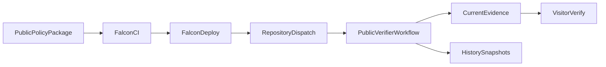

# fawa-compliance-evidence

Public, machine-readable compliance evidence for Falcon deployments.

## Trust Model

- `panalgin/falcon` (private) runs CI, OPA policy gate, image signing/attestation, and deployment.
- This repository (public) receives a deployment event and independently verifies Falcon run metadata and artifacts.
- Verified outputs are published under `current/` and immutable snapshots under `history/`.
- Consumers (UI or auditors) read only this repository as the public source of truth.

## End-To-End Flow



## Repository Layout

- `schemas/evidence.schema.json`: canonical schema for `current/evidence.json`.
- `schemas/test-evidence-manifest.schema.json`: schema for Falcon CI compliance manifest artifact.
- `schemas/test-artifact.schema.json`: schema for sanitized `current/tests/*.json` artifacts.
- `policy/version.json`: public policy package manifest consumed by Falcon CI.
- `policy/v1/ci.rego`: policy file referenced by the manifest.
- `toolkit/package/`: source for published npm package `@daflan-org/falcon-compliance-toolkit`.
- `.github/workflows/publish-toolkit-package.yml`: publishes toolkit package to GitHub Packages.
- `toolkit/version.json` and `toolkit/v1/*.ts`: public source transparency for toolkit logic.
- `current/evidence.json`: latest verified evidence payload.
- `current/deploy-run.json`: normalized deploy job metadata.
- `current/tests/*.json|*.junit.xml`: sanitized test artifacts copied from Falcon CI artifacts.
- `history/<timestamp>-<sha>/`: immutable evidence snapshots.
- `history/index.json`: snapshot index for discovery.
- `scripts/verify-current.sh`: one-command public verification script.
- `.github/workflows/verify-and-publish.yml`: dispatch-driven verifier/publisher workflow.
- `.github/workflows/sign-policy-package.yml`: secret-backed policy signing workflow.

## Assertion Evidence Model

Each test entry in `current/evidence.json` includes machine-verifiable assertions:

- `testEvidence[].assertions[].assertionId`
- `testEvidence[].assertions[].status` (`passed|failed`)
- `testEvidence[].assertions[].expected`
- `testEvidence[].assertions[].actual`
- `testEvidence[].assertions[].evidenceRef` (`filePath`, `matcherType`, `matcher`)
- `assertionSummary` (aggregate counts across all tests)

Verifier workflow gates publish on these checks:

- Manifest schema validation
- Test artifact schema validation
- Non-empty assertions for each required test
- No failed assertions

## Dispatch Contract

Falcon sends `repository_dispatch` with `event_type=falcon-deploy-verified` and payload:

```json
{
  "schema_version": "1.0.0",
  "source": {
    "repo": "panalgin/falcon",
    "ref": "pre-prod",
    "sha": "<commit_sha>"
  },
  "environment": "pre-prod|prod",
  "ci": {
    "run_id": "<run_id>",
    "artifact_name": "compliance-test-evidence-<run_id>",
    "policy_artifact_name": "policy-provenance-<run_id>"
  },
  "deploy": {
    "run_id": "<run_id>",
    "workflow_name": "<workflow_name>",
    "run_number": "<run_number>"
  },
  "images": {
    "api": {
      "image": "ghcr.io/<owner>/<api_image>",
      "digest": "sha256:<digest>"
    },
    "worker": {
      "image": "ghcr.io/<owner>/<worker_image>",
      "digest": "sha256:<digest>"
    }
  }
}
```

## Required Secrets And Permissions

`verify-and-publish.yml` expects:

- `EVIDENCE_BOT_APP_ID`
- `EVIDENCE_BOT_APP_PRIVATE_KEY`

`sign-policy-package.yml` expects:

- `POLICY_SIGNING_PRIVATE_KEY` (PEM private key, escaped with `\n` in GitHub secret)

`publish-toolkit-package.yml` uses:

- `GITHUB_TOKEN` (built-in, requires `packages: write` permission in workflow)

GitHub App minimum permissions:

- On `panalgin/falcon`: `Actions: Read`, `Contents: Read`
- On `daflan-org/fawa-compliance-evidence`: `Contents: Write`

## Toolkit Package

Toolkit package is published to GitHub Packages as:

- `@daflan-org/falcon-compliance-toolkit`

Local usage example:

```bash
npx --yes @daflan-org/falcon-compliance-toolkit@1.1.0 build-policy-input
```

## Public Verification

Run the full public verification flow:

```bash
curl -fsSL "https://raw.githubusercontent.com/daflan-org/fawa-compliance-evidence/main/scripts/verify-current.sh" | bash
```

What this verifies:

- `current/evidence.json` matches `schemas/evidence.schema.json`
- each `current/tests/*.json` artifact matches `schemas/test-artifact.schema.json`
- artifact SHA256 values match `evidence.json`
- all assertion statuses are `passed`

Optional cosign verification (if `cosign` is installed):

```bash
curl -fsSL "https://raw.githubusercontent.com/daflan-org/fawa-compliance-evidence/main/scripts/verify-current.sh" | RUN_COSIGN=1 bash
```

## Troubleshooting

- `artifact not found`: CI artifact retention may have expired; rerun Falcon CI and redeploy.
- `head_sha mismatch`: dispatch payload does not match Falcon run metadata.
- `policy signature verification failed`: policy file, signature, or public key is inconsistent.
- `no evidence changes to publish`: payload points to already published deploy run/snapshot.
